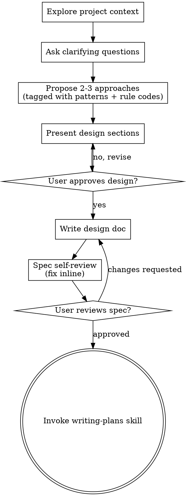

# Brainstorming Ideas Into Designs

Help turn ideas into fully formed designs and specs through natural collaborative dialogue.

Start by understanding the current project context, then ask questions one at a time to refine the idea. Once you understand what you're building, present the design and get user approval.

<HARD-GATE>
Do NOT invoke any implementation skill, write any code, scaffold any project, or take any implementation action until you have presented a design and the user has approved it. This applies to EVERY project regardless of perceived simplicity.
</HARD-GATE>

## Anti-Pattern: "This Is Too Simple To Need A Design"

Every project goes through this process. A todo list, a single-function utility, a config change — all of them. "Simple" projects are where unexamined assumptions cause the most wasted work. The design can be short (a few sentences for truly simple projects), but you MUST present it and get approval.

## Companion skills (consult, don't invoke)

This project uses **NestJS 11 + TypeScript 6.0**. While brainstorming, **read** the following three skills as design references — do not call them as workflow steps:

- **`clean-ddd-hexagonal`** — for architectural decisions: aggregates, ports, layer boundaries. Use its decision trees when proposing approaches that touch domain logic. Anchor concrete code shape in `${CLAUDE_SKILL_DIR}/../clean-ddd-hexagonal/references/NESTJS-MAPPING.md`.
- **`nestjs-best-practices`** — for NestJS-specific tradeoffs: auth, guards, scopes, validation, caching, queues. Cite rule codes (e.g. `security-auth-jwt`, `arch-feature-modules`) when proposing options.
- **`javascript-typescript-jest`** — for the testing strategy section of the spec. Locks file naming (`*.spec.ts` / `*.e2e-spec.ts`), per-layer mocking (no mocks in domain, hand-written port fakes in application, realistic doubles in infrastructure), and Supertest E2E patterns.

The output spec must explicitly note which architectural patterns, rule codes, and per-layer testing approach apply to each part of the design, so `writing-plans` can use them downstream.

## Checklist

You MUST create a task for each of these items and complete them in order:

1. **Explore project context** — check files, docs, recent commits. Read `package.json`, `nest-cli.json`, `tsconfig.json`, and any module under `src/modules/` that resembles the area being changed.
2. **Ask clarifying questions** — one at a time, understand purpose / constraints / success criteria.
3. **Propose 2-3 approaches** — with trade-offs and your recommendation. Tag each approach with the architectural patterns from `clean-ddd-hexagonal` and the rule codes from `nestjs-best-practices` it relies on.
4. **Present design** — in sections scaled to their complexity, get user approval after each section.
5. **Write design doc** — save to `docs/specs/YYYY-MM-DD-<topic>-design.md`.
6. **Spec self-review** — quick inline check for placeholders, contradictions, ambiguity, scope (see below).
7. **User reviews written spec** — ask user to review the spec file before proceeding.
8. **Transition to implementation** — invoke `writing-plans` skill to create implementation plan.

> **Visual Companion (opt-in, optional):** if a question is genuinely visual (mockups, layouts, side-by-side designs), the browser-based companion is available — see `${CLAUDE_SKILL_DIR}/visual-companion.md`. Do not offer it for purely conceptual or text questions. Most NestJS-backend brainstorming sessions never need it.

## Process Flow

**The terminal state is invoking `writing-plans`.** Do NOT invoke any other implementation skill.

## The Process

**Understanding the idea:**

- Check out the current project state first (files, docs, recent commits)
- Before asking detailed questions, assess scope: if the request describes multiple independent subsystems (e.g., "build a platform with chat, file storage, billing, and analytics"), flag this immediately. Don't spend questions refining details of a project that needs to be decomposed first.
- If the project is too large for a single spec, help the user decompose into sub-projects: what are the independent pieces, how do they relate, what order should they be built? Then brainstorm the first sub-project through the normal design flow. Each sub-project gets its own spec → plan → implementation cycle.
- For appropriately-scoped projects, ask questions one at a time to refine the idea
- Prefer multiple-choice questions when possible, but open-ended is fine too
- Only one question per message - if a topic needs more exploration, break it into multiple questions
- Focus on understanding: purpose, constraints, success criteria

**Exploring approaches:**

- Propose 2-3 different approaches with trade-offs
- For each approach, attach the layer (`domain` / `application` / `infrastructure`), the patterns from `clean-ddd-hexagonal` (e.g., aggregate, repository port, domain event, anti-corruption layer), and the relevant rule codes from `nestjs-best-practices` (e.g., `arch-feature-modules`, `di-use-interfaces-tokens`, `security-validate-all-input`)
- Present options conversationally with your recommendation and reasoning
- Lead with your recommended option and explain why

**Presenting the design:**

- Once you believe you understand what you're building, present the design
- Scale each section to its complexity: a few sentences if straightforward, up to 200-300 words if nuanced
- Ask after each section whether it looks right so far
- Cover: bounded context, aggregates / VOs / events, ports & adapters, module wiring, error handling, testing strategy per layer
- Be ready to go back and clarify if something doesn't make sense

**Design for isolation and clarity:**

- Break the system into smaller units that each have one clear purpose, communicate through well-defined interfaces, and can be understood and tested independently
- For each unit, you should be able to answer: what does it do, how do you use it, and what does it depend on?
- Smaller, well-bounded units are also easier for both you and reviewers to work with

**Working in existing codebases:**

- Explore the current structure before proposing changes. Follow existing patterns from `src/modules/`.
- Where existing code has problems that affect the work (e.g., domain leaking into infrastructure, a controller calling a repository directly), include targeted improvements as part of the design.
- Don't propose unrelated refactoring. Stay focused on what serves the current goal.

## After the Design

**Documentation:**

- Write the validated design (spec) to `docs/specs/YYYY-MM-DD-<topic>-design.md`
- (User preferences for spec location override this default)
- Use plain, concise prose. Each section opens with the decision, then the why.

**Required spec sections (NestJS hexagonal):**

1. **Goal** — one sentence
2. **Bounded context & module placement** — which `src/modules/<context>/` folder, or new
3. **Domain model** — aggregates, entities, value objects, domain events; invariants
4. **Ports** — driver and driven, with their token names (`UPPER_SNAKE`)
5. **Use cases (application layer)** — Command/Query DTOs and the handler signatures
6. **Adapters** — HTTP, persistence, messaging; mapping responsibilities
7. **Cross-cutting** — auth, validation, errors, logging, caching, throttling — each tagged with its `nestjs-best-practices` rule code
8. **Testing strategy** — what each layer is tested with (unit, integration, E2E)
9. **Out of scope** — explicit list to prevent scope creep

**Spec Self-Review:**
After writing the spec document, look at it with fresh eyes:

1. **Placeholder scan:** Any "TBD", "TODO", incomplete sections, or vague requirements? Fix them.
2. **Internal consistency:** Do any sections contradict each other? Does the architecture match the feature descriptions?
3. **Scope check:** Is this focused enough for a single implementation plan, or does it need decomposition?
4. **Ambiguity check:** Could any requirement be interpreted two different ways? If so, pick one and make it explicit.
5. **Layer purity check:** Does any item put domain logic in infrastructure, or vice versa? Fix the placement.
6. **Rule-code coverage:** Are the cross-cutting concerns (validation, auth, errors, logging) tagged with explicit rule codes?

Fix any issues inline. No need to re-review — just fix and move on.

**Escalate to a reviewer subagent when the spec is large.** The checklist above is the default and you run it yourself. When the spec spans more than one bounded context, introduces more than ~3 aggregates, or you are uncertain about layer placement, dispatch an independent reviewer instead of self-reviewing: use the template at `${CLAUDE_SKILL_DIR}/spec-document-reviewer-prompt.md` (Agent tool, `subagent_type: "general-purpose"`, read-only). Fix any blocking issue it reports before the user review gate below.

**User Review Gate:**
After the spec review loop passes, ask the user to review the written spec before proceeding:

> "Spec written to `<path>`. Please review it and let me know if you want to make any changes before we start writing out the implementation plan."

Wait for the user's response. If they request changes, make them and re-run the spec review loop. Only proceed once the user approves.

**Implementation:**

- Invoke the `writing-plans` skill to create a detailed implementation plan
- Do NOT invoke any other skill. `writing-plans` is the next step.

## Key Principles

- **One question at a time** - Don't overwhelm with multiple questions
- **Multiple choice preferred** - Easier to answer than open-ended when possible
- **YAGNI ruthlessly** - Remove unnecessary features from all designs
- **Explore alternatives** - Always propose 2-3 approaches before settling
- **Incremental validation** - Present design, get approval before moving on
- **Be flexible** - Go back and clarify when something doesn't make sense
- **Never commit on the user's behalf** — this skill writes design docs only. If a commit feels appropriate (e.g., the spec is finalized), suggest it: _"Te sugiero hacer un commit del spec por <razón>"_. Wait for explicit user instruction to actually commit.
