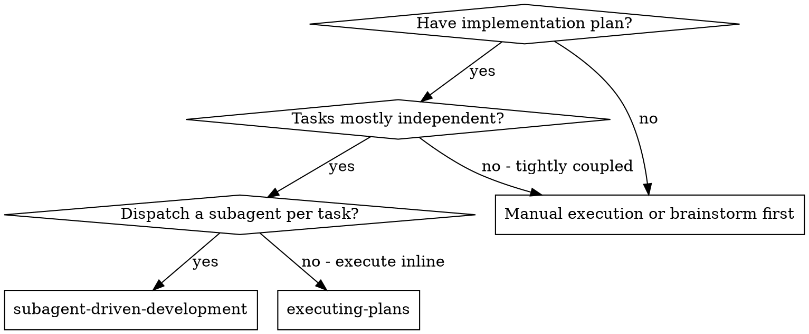
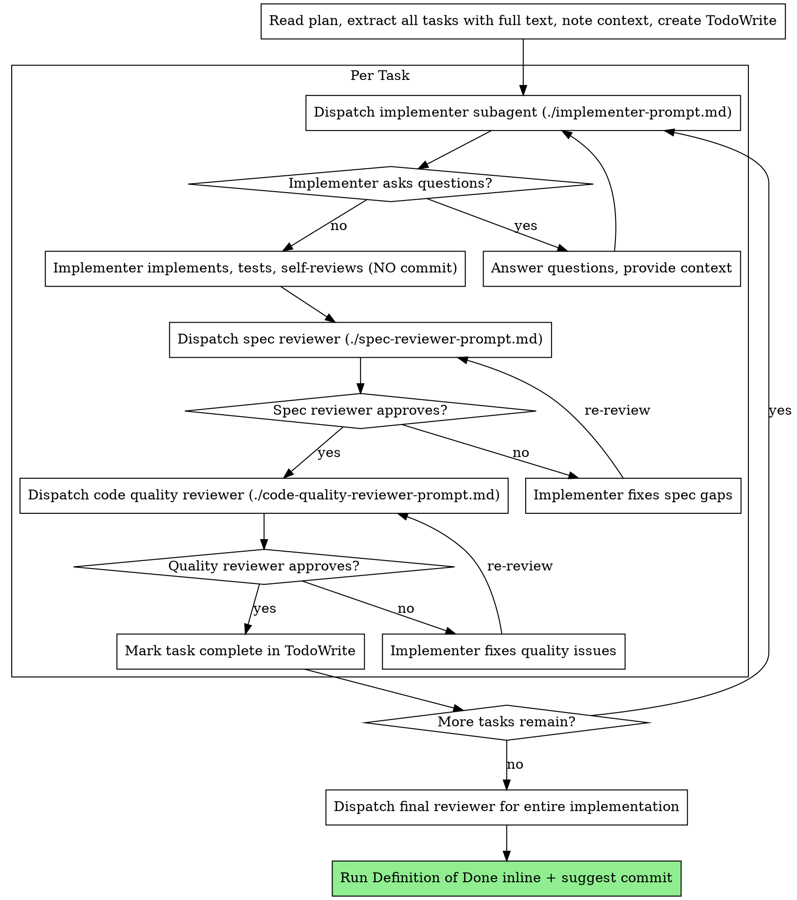

# Subagent-Driven Development

Execute a plan by dispatching a fresh subagent per task, with two-stage review after each: spec compliance review first, then code quality review.

**Why subagents:** delegate tasks to agents with isolated context. By precisely crafting their instructions, you keep them focused and protect your own context window for coordination work. Subagents never inherit your session history — you build exactly what they need.

**Core principle:** fresh subagent per task + two-stage review (spec then quality) = high quality, fast iteration.

**Stack:** NestJS 11 + TypeScript 6.0, `pnpm`, Jest, Supertest. Companion skills `clean-ddd-hexagonal`, `nestjs-best-practices`, and `javascript-typescript-jest` apply to every dispatch — every implementer prompt MUST cite all three.

## Tooling notes (Claude Code)

- All subagent dispatches use the **`Agent` tool** with `subagent_type: "general-purpose"` unless noted.
- For pure research dispatches (read-only investigation, no edits), prefer `subagent_type: "Explore"`.
- For architectural / design subagents (e.g., the final reviewer), prefer `subagent_type: "Plan"`.
- The implementer subagent is `general-purpose` — it must be allowed to read, edit, and run tests.

## When to Use



## The Process



## Casos primero (modelo de colaboración)

Cuando una tarea del plan trae tabla **«Casos acordados»** (spec
`docs/specs/2026-08-04-roadmap-and-collaboration-model-design.md`), el ciclo del implementer es
fijo: confirmación JIT con el controller → tests en ROJO 1:1 con la tabla (con evidencia de la
salida) → implementación a verde → refactor. El reporte incluye el mapeo casos ↔ suite y el
score de mutación del módulo (`pnpm test:mutation --mutate "src/modules/<context>/…"`).
Un `it` sin fila, una fila sin `it`, o implementación sin rojo previo **fallan la spec
compliance review**.

## No-Commit Policy (NON-NEGOTIABLE)

Subagents — implementer, spec reviewer, quality reviewer, final reviewer — **never** run `git commit`, `git add` for commit purposes, `git push`, `git tag`, or `git rebase`. Their job is to write/inspect code and report. The user owns the git history.

When the implementer or final reviewer thinks a commit is appropriate, they **report a suggestion** in the format:

> _"Te sugiero hacer un commit de los cambios por <razón>"_

…and stop. The controller (you) surfaces the suggestion to the user, who decides.

If a subagent ever runs `git commit` without explicit user instruction, that is a defect — re-dispatch with a corrected prompt.

## Model Selection

Use the least powerful model that can handle each role to conserve cost and increase speed.

- **Mechanical implementation (1–2 files, complete spec):** fast, cheap model.
- **Integration / debugging (multiple files):** standard model.
- **Architecture / final review:** most capable model available.

**Task complexity signals:**

- 1–2 files with a complete spec → cheap model
- Multiple files with integration concerns → standard model
- Cross-context refactor or design judgment → most capable model

## Handling Implementer Status

Implementers report one of four statuses:

- **DONE** — proceed to spec compliance review.
- **DONE_WITH_CONCERNS** — read the concerns first. If they're about correctness or scope, address them before review. If they're observations ("file is getting large"), note them and proceed.
- **NEEDS_CONTEXT** — provide the missing context and re-dispatch.
- **BLOCKED** — assess the blocker:
  1. Context problem → provide more context, re-dispatch with the same model.
  2. Needs more reasoning → re-dispatch with a more capable model.
  3. Task too large → break it into smaller pieces.
  4. Plan is wrong → escalate to the user.

Never ignore an escalation or force the same model to retry without changes.

## Definition of Done (run inline at the end)

After the final reviewer approves, run this directly — **do not invoke any external "finishing" skill**:

```bash
pnpm typecheck
pnpm lint:check
pnpm test
pnpm test:e2e
pnpm build
```

Then **suggest a commit** to the user (do not run it):

> _"Te sugiero hacer un commit de los cambios por terminar la implementación del plan `<plan-file>`. Avísame y lo redacto."_

## Prompt Templates

- `${CLAUDE_SKILL_DIR}/implementer-prompt.md` — Dispatch implementer subagent (general-purpose).
- `${CLAUDE_SKILL_DIR}/spec-reviewer-prompt.md` — Dispatch spec compliance reviewer (general-purpose, read-only).
- `${CLAUDE_SKILL_DIR}/code-quality-reviewer-prompt.md` — Dispatch code quality reviewer (general-purpose, read-only).

The `./…` paths inside the diagrams above are node labels, not paths to resolve — always load these templates through `${CLAUDE_SKILL_DIR}`.

## Example Workflow

```
You: "I'm using Subagent-Driven Development to execute this plan."

[Read plan once: docs/plans/feature-plan.md]
[Extract all 5 tasks with full text and context]
[Create TodoWrite with all tasks]

Task 1: Domain entity for Invoice

[Get Task 1 text and context]
[Dispatch implementer with Agent tool: subagent_type=general-purpose]

Implementer: "Should InvoiceId be a branded number or a string?"
You: "String — see InvoiceId.vo.ts pattern in src/modules/billing."

Implementer: "Got it. Implementing now…"
[Later] Implementer report:
  - Status: DONE
  - Implemented Invoice.entity.ts + VOs + InvoiceIssued event
  - 6/6 unit tests passing (pnpm jest src/modules/billing/domain)
  - No @nestjs/* imports in domain/ (verified by grep)
  - No git operations performed

[Dispatch spec compliance reviewer (read-only)]
Spec reviewer: ✅ Spec compliant — all invariants covered, nothing extra.

[Dispatch code quality reviewer (read-only)]
Quality reviewer:
  Strengths: clean VO factories, exhaustive tests
  Issues: None
  Approved.

[Mark Task 1 complete in TodoWrite]
[Continue with Task 2…]

…

[After all tasks: dispatch final reviewer with subagent_type=Plan]
Final reviewer: All tasks complete, layers respected, rule codes honored.

[Run DoD inline: typecheck/lint/test/test:e2e/build all pass]

You (to user): "Implementation complete. Te sugiero hacer un commit de los
cambios por implementar el plan `feat-billing-invoice.md` (Tasks 1–5).
Avísame y lo redacto."

[STOP. Wait for user instruction before any git command.]
```

## Advantages

**vs. manual execution:** subagents follow TDD naturally, fresh context per task, parallel-safe (caveats below), can ask questions before starting.

**vs. executing-plans:** both run in the current session, but this skill isolates each task in a fresh subagent context instead of executing inline — your own context stays free for coordination, and every task gets automatic two-stage review.

**Efficiency gains:** controller curates exactly the context the subagent needs; subagent receives complete information up front; questions surface before work begins.

**Quality gates:** self-review catches issues before handoff; two-stage review (spec then quality); review loops ensure fixes actually work.

**Cost:** more subagent invocations (implementer + 2 reviewers per task). Worth it because issues are caught early — cheaper than debugging later.

## Red Flags

**Never:**

- Start implementation on `main`/`master` without explicit user consent.
- Skip reviews (spec compliance OR code quality).
- Proceed with unfixed issues.
- Dispatch multiple **implementation** subagents in parallel (file conflicts). Reviewers can run in parallel only when reviewing different tasks.
- Make a subagent read the plan file (provide the full task text instead).
- Skip scene-setting context.
- Ignore subagent questions.
- Accept "close enough" on spec compliance.
- Implement without a captured RED run when the task has a case table.
- Add or reword a case without JIT confirmation from the controller.
- Start the code quality review before spec compliance is ✅ (wrong order).
- Move to the next task while either review has open issues.
- **Run `git commit`, `git add` for commit purposes, or `git push` without explicit user instruction in the current turn.** Suggest, don't commit.

**If subagent asks questions:** answer clearly and completely. Don't rush them.

**If reviewer finds issues:** the implementer (same conceptual subagent — you re-dispatch with the fix prompt) fixes them. Reviewer reviews again. Repeat until approved.

**If subagent fails task:** dispatch a fix subagent with specific instructions. Don't try to fix manually (context pollution).

## Integration

- **Upstream skill:** `writing-plans` produces the plan this skill executes.
- **Companion skills (read, don't invoke):** `clean-ddd-hexagonal` (layer rules), `nestjs-best-practices` (rule codes), and `javascript-typescript-jest` (test conventions, layer-aware mocking).
- **Sister skill:** `executing-plans` — same session, but executes every task inline in your own context instead of dispatching subagents. Prefer it for small or tightly coupled plans.
