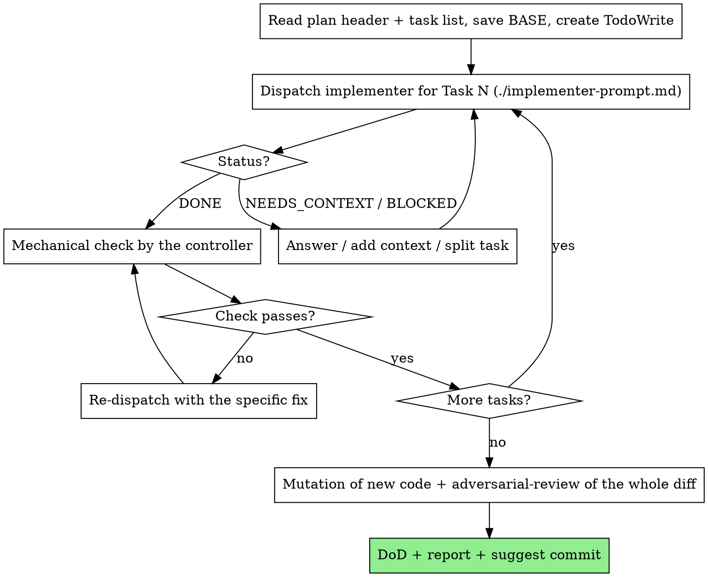

# Subagent-Driven Development

Execute a plan by dispatching a fresh implementer subagent per task. You are the **controller**:
you keep your context for coordination, check each task mechanically, and audit the whole result
once at the end.

**Stack:** NestJS 12 + TypeScript 6.0, `pnpm`, Jest, Supertest (exact versions: the «Stack» line
of `CLAUDE.md`). Subagents run tests only through `pnpm test` / `pnpm test:e2e`.

## When to use it — and when not

Use it only when **all** of these hold:

- the plan has ~10 or more tasks;
- most tasks don't touch the same files, so a fresh context per task loses nothing;
- your own context would not survive executing the whole plan inline.

Otherwise use `executing-plans`. Measured on 2026-09-30 with an 11-task plan of coupled tasks
(`docs/development-workflows.md`): this skill took ≈129 min of machine time and 36.01 USD; inline
execution of the same plan took ≈17 min and 6.66 USD. The code was the same, and the 16 per-task
spec and quality reviewers found 0 defects. An adversarial review of the final diff then found
the important one that every per-task review had missed: an enumeration oracle in the 404.

## Tooling notes (Claude Code)

- Implementers are dispatched with the `Agent` tool, `subagent_type: "general-purpose"`: it
  loads `CLAUDE.md`, and it may read, edit and run tests. `Plan` and `Explore` do not load
  `CLAUDE.md` (measured 2026-09-29: ≈16–19k tokens of initial context against ≈48–50k).
- The project's `.claude/settings.json` denies mutating git commands to every agent, subagents
  included.

## The Process


```dot
digraph process {
    rankdir=TB;
    "Read plan header + task list, save BASE, create TodoWrite" [shape=box];
    "Dispatch implementer for Task N (./implementer-prompt.md)" [shape=box];
    "Status?" [shape=diamond];
    "Answer / add context / split task" [shape=box];
    "Mechanical check by the controller" [shape=box];
    "Check passes?" [shape=diamond];
    "Re-dispatch with the specific fix" [shape=box];
    "More tasks?" [shape=diamond];
    "Mutation of new code + adversarial-review of the whole diff" [shape=box];
    "DoD + report + suggest commit" [shape=box style=filled fillcolor=lightgreen];

    "Read plan header + task list, save BASE, create TodoWrite" -> "Dispatch implementer for Task N (./implementer-prompt.md)";
    "Dispatch implementer for Task N (./implementer-prompt.md)" -> "Status?";
    "Status?" -> "Answer / add context / split task" [label="NEEDS_CONTEXT / BLOCKED"];
    "Answer / add context / split task" -> "Dispatch implementer for Task N (./implementer-prompt.md)";
    "Status?" -> "Mechanical check by the controller" [label="DONE"];
    "Mechanical check by the controller" -> "Check passes?";
    "Check passes?" -> "Re-dispatch with the specific fix" [label="no"];
    "Re-dispatch with the specific fix" -> "Mechanical check by the controller";
    "Check passes?" -> "More tasks?" [label="yes"];
    "More tasks?" -> "Dispatch implementer for Task N (./implementer-prompt.md)" [label="yes"];
    "More tasks?" -> "Mutation of new code + adversarial-review of the whole diff" [label="no"];
    "Mutation of new code + adversarial-review of the whole diff" -> "DoD + report + suggest commit";
}
```

### 1. Set up

Read the plan's header and task list, and save the base with `git rev-parse HEAD`. Create one
`TodoWrite` entry per task. Nothing is committed while you work, so `git status` accumulates every task: before each
dispatch, take a fingerprint of what is already changed, deletions included, so the check can tell
which files THIS task touched:

```bash
git ls-files -z --modified --deleted --others --exclude-standard | sort -zu |
  while IFS= read -r -d '' f; do
    if [ -e "$f" ]; then shasum "$f"; else echo "deleted  $f"; fi
  done > <scratch>/before-N
```

**Don't paste whole tasks into prompts**: the implementer reads its own
task from the plan file. In the experiment, 38 % of everything the controller wrote was pasted
task text.

### 2. Dispatch the implementer

Use `${CLAUDE_SKILL_DIR}/implementer-prompt.md` with the plan path, the task heading, the spec
path and any scene-setting the task alone doesn't give: what earlier tasks produced, and what
changed from the plan. **One implementer at a time**, because parallel implementers collide on
files.

### 3. Handle the status

- **DONE** → mechanical check.
- **DONE_WITH_CONCERNS** → read the concerns first. Correctness or scope concerns are addressed
  before the check. Observations are noted.
- **NEEDS_CONTEXT** → the implementer could not continue without an answer. Answer it (ask the
  user if it is a business decision) and re-dispatch.
- **BLOCKED** → context problem: add context. Needs more reasoning: use a more capable model.
  Task too large: split it. Plan wrong: escalate to the user.

### 4. Mechanical check (you, no subagent)

- `pnpm test <task specs> --reporters=default --verbose` passes, and the list of `it` titles
  matches the task's «Casos acordados» row by row. No row without an `it`, no `it` without a row.
  `--reporters=default` is not optional: inside Claude Code (`CLAUDECODE=1`) Jest switches to an
  agent reporter that ignores `--verbose` and prints no title at all (measured: 0 titles without
  it, 26 with it). An `*.e2e-spec.ts` goes through `pnpm test:e2e <spec>`: `pnpm test` answers
  «No tests found» and exits with 1.
- The report shows the **red run failing on assertions** for every spec with a case table. A case
  that kills a surviving mutant passes at once — the code already does what it asserts — and its
  red is the mutant applied by hand, the test failing by assertion, and the code restored.
- Every guard test the task lists was proven to fail without its protection.
- `pnpm typecheck` passes; `grep` finds no `@nestjs/*` or ORM import under `domain/`.
- Rerun the fingerprint into `<scratch>/after-N` and `diff` the two files. Every line on EITHER
  side names a file this task touched: changed, created, deleted, or reverted to `HEAD` (a
  revert only shows on the `before` side). Each one must be a file the task declared.

A failure gets a re-dispatch with the specific fix. Don't fix it yourself: that pollutes your
context.

### 5. High-risk tasks

A task that touches security, concurrency, a migration or a cross-context seam gets no review of
its own: its guard tests are proven in the mechanical check, and the audit stays at the end. In the
experiment, 16 per-task reviewers found 0 defects and the final review found the one that
mattered, so a review per risky task would bring back the cost this skill exists to avoid.

### 6. After the last task

1. **Mutation of the new code:** `pnpm test:mutation:changed <BASE>`. Propose the cases that kill
   survivors, all of them in one question; approved cases go through an implementer like any task.
2. **Adversarial review** of the whole diff: the `adversarial-review` skill with `<BASE>` and the
   plan path. Critical and important findings go to an implementer as a fix task. If a fix touched
   `domain/` or `application/`, rerun the mutation: the reported score is the final code's.
3. **Documentation:** `CLAUDE.md` / `README.md` if a module description, a public contract or the
   endpoints table changed.
4. **Definition of Done**, run by you:

```bash
pnpm typecheck
pnpm lint:check
pnpm format:check
pnpm test
pnpm test:e2e
pnpm build
```

5. **Report and suggest a commit.** Use the same report as `executing-plans`, Step 5, plus the
   tasks that needed a re-dispatch and why. Never run the commit:

> _"Te sugiero hacer un commit de los cambios por terminar la implementación del plan
> `<plan-file>`. Avísame y lo redacto."_

## No-Commit Policy (NON-NEGOTIABLE)

No agent runs a git command that writes history, moves `HEAD` or a ref, touches the index or
discards work — `commit`, `add`, `push`, `stash`, `reset`, `checkout`, `branch`… That covers you,
the implementers and the reviewer. The project settings deny them, with any global option in
front (the list is in `.claude/settings.json`; the policy, in `CLAUDE.md`, «Git policy»). An implementer that thinks a commit is due puts a
suggestion in its report, and you relay it to the user.

## Model Selection

Use the least powerful model that can handle each task:

- 1–2 files with complete interfaces and cases → fast, cheap model;
- several files with integration concerns → standard model;
- design judgment, cross-context work or the final review → the most capable model.

## Red Flags

**Never:**

- start on `main`/`master` without explicit user consent;
- dispatch several implementers in parallel;
- paste the whole plan into a prompt; the implementer reads its task from the file;
- accept a task without a red run by assertion when it has a case table;
- add or reword a case without the user's approval (grouped, not per task);
- move on while the mechanical check fails;
- run a committing git command.

## Integration

- **Upstream:** `writing-plans` (the plan), `brainstorming` (the spec).
- **Final review:** `adversarial-review`.
- **Sister skill:** `executing-plans`, the default. It runs in the same session and ends with the
  same audit, but does the work inline.
